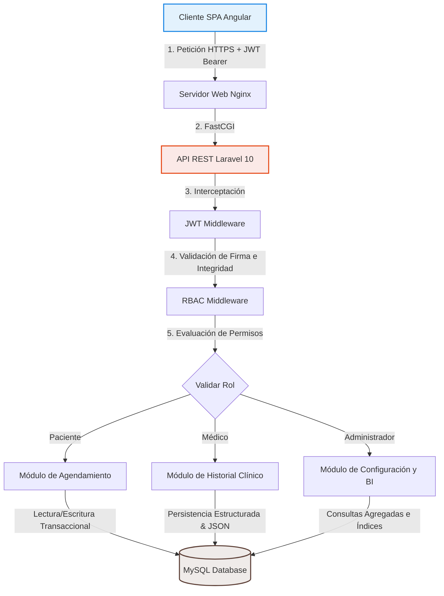
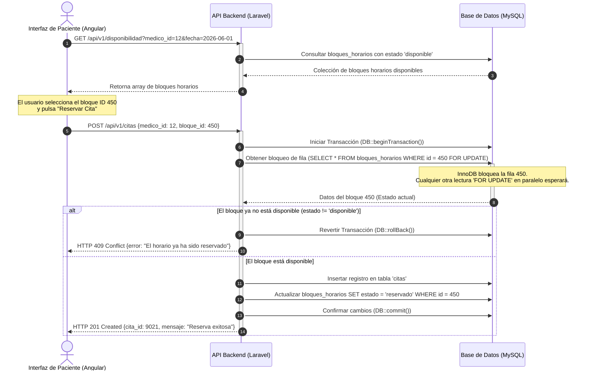

# SOMA-PSIQUE
Arquitectura  técnica y documentación de un Sistema de Gestión Clínica y Agendamiento Médico (Angular + Laravel) 
# Sistema de Gestión Clínica y Agendamiento Médico 

Este repositorio presenta el caso de estudio de arquitectura y las decisiones de diseño de software implementadas en un **Sistema de Gestión Clínica y Agendamiento Médico**. Por razones de confidencialidad, propiedad intelectual y acuerdos comerciales, el código fuente del proyecto permanece en un repositorio privado. Este documento tiene como objetivo detallar la arquitectura técnica del sistema, las estrategias de mitigación de problemas de concurrencia y la resolución de desafíos complejos de bases de datos.

El sistema fue diseñado bajo el principio de separación de responsabilidades (*Separation of Concerns*), estructurado como una aplicación de página única (SPA) totalmente desacoplada del servidor de servicios de backend.

---

## 1. Resumen Ejecutivo

El sistema está concebido para optimizar la operación diaria de clínicas de mediana y gran escala, abarcando desde el flujo de recepción del paciente hasta la consulta médica y la facturación. El núcleo del sistema gestiona la asignación de recursos (médicos, especialidades y consultorios), el control de acceso basado en roles y el ciclo de vida de la cita médica.

### Stack Tecnológico
*   **Frontend (Angular & TypeScript):** Estructurado con una arquitectura modular por componentes y servicios reactivos basados en RxJS.
    *   *Integración de Plantilla Base (UI Architecture Boilerplate / Admin Template):* Como acelerador de desarrollo, el frontend integra un *core template* de nivel empresarial en lugar de construir la interfaz desde cero.
    *   *Propósito de Eficiencia:* Reutiliza componentes de UI preestablecidos (estructuras de layouts, navegación principal, tablas de datos complejos y formularios estándar) reduciendo drásticamente el *Time-to-Market* y permitiendo concentrar el esfuerzo de desarrollo puramente en las reglas de negocio críticas y la integración con la API.
    *   *Adaptabilidad y Personalización:* La plantilla base fue desacoplada, modularizada y modificada a nivel de estilos globales (SCSS/CSS), servicios y componentes para cumplir estrictamente con los flujos lógicos clínicos y las pautas de marca (*White-labeling*) especificadas por el cliente.
*   **Backend (Laravel 10 & PHP):** Operando estrictamente como una API REST stateless. Implementa controladores de recursos orientados a dominio y persistencia gestionada a través de Eloquent ORM.
*   **Base de Datos (MySQL):** Optimizada para cargas de trabajo transaccionales (OLTP) mediante el uso del motor InnoDB, indexación estratégica y particionado lógico.
*   **Autenticación y Autorización:** Bearer Tokens utilizando JSON Web Tokens (JWT) y Middleware personalizado para la verificación del control de acceso basado en roles (RBAC).

---

## 2. Diagrama de Arquitectura

El siguiente diagrama de flujo ilustra la topología de la aplicación, el flujo de las peticiones HTTP seguras y la distribución de responsabilidades en la infraestructura lógica del backend:

---

## 3. 🚀 Funcionalidades Clave e Ingeniería de Implementación

### 1. Buscador Inteligente de Diagnósticos (Catálogo CIE-11)
*   **Funcionalidad:** Input reactivo que permite a los médicos buscar y autocompletar diagnósticos en tiempo real durante la consulta médica, consultando eficientemente una base de datos con más de 70,000 registros de la clasificación oficial de la OMS.
*   **Ingeniería:** Uso de índices de texto completo (`FULLTEXT` y sentencias `MATCH AGAINST`) en MySQL para garantizar tiempos de respuesta en milisegundos. En el cliente Angular, se implementaron operadores reactivos de RxJS (`debounceTime`, `distinctUntilChanged`, `switchMap`) para evitar la saturación de peticiones HTTP innecesarias al backend.

### 2. Historial Clínico Dinámico y Adaptativo
*   **Funcionalidad:** Formularios de evolución clínica y carga de exámenes paraclínicos que adaptan su estructura dinámicamente según la especialidad del médico (ej. cardiología captura parámetros métricos específicos, diferentes a los campos cualitativos de psicología).
*   **Ingeniería:** Implementación de un esquema híbrido SQL/JSON. Uso de columnas de tipo `JSON` en MySQL mapeadas mediante mutadores y `$casts` de tipo array en los modelos Eloquent de Laravel. Esto otorga la flexibilidad de un almacenamiento semiestructurado sin romper la integridad referencial y relacional de pacientes y citas médicas.

### 3. Motor de Disponibilidad Horaria y Control de Concurrencia
*   **Funcionalidad:** Sistema de asignación de turnos médicos que bloquea visual y lógicamente el cruce de horarios entre doctores, especialidades y consultorios físicos en tiempo real.
*   **Ingeniería:** Uso de transacciones atómicas a nivel de base de datos (`DB::transaction`) y mecanismos de bloqueo pesimista de filas (`SELECT ... FOR UPDATE`) en Laravel para evitar condiciones de carrera (*Race Conditions*) y dobles reservas simultáneas. Estructurado sobre tablas pivot indexadas que aceleran la futura extracción de métricas para Business Intelligence (BI).

---

## 4. Lógica de Negocio y Control de Concurrencia

El agendamiento de citas médicas en entornos de alta demanda presenta el riesgo de colisiones de reserva (doble agendamiento), donde dos pacientes intentan reservar el mismo bloque de tiempo de un médico simultáneamente. Para solucionar esto, el sistema implementa una estrategia de control de concurrencia pesimista en la base de datos, manejada dentro del contexto de una transacción atómica del motor InnoDB.

El siguiente diagrama de secuencia detalla el flujo de validación y confirmación de reserva:

---

## 5. Conclusiones de Ingeniería

La implementación del sistema bajo este patrón arquitectónico de desacoplamiento completo aportó beneficios críticos para la sostenibilidad del proyecto a largo plazo:

1.  **Seguridad Robusta en los Endpoints:** La API REST de Laravel no confía en los datos suministrados por el cliente. Cada petición entrante se intercepta en la capa de Middleware, asegurando que el token JWT sea válido y que el rol del usuario esté explícitamente autorizado para consumir el endpoint solicitado (RBAC estricto).
2.  **Escalabilidad Independiente:** Al separar la interfaz del servidor de aplicaciones, la SPA Angular puede servirse a través de redes de distribución de contenido (CDN), reduciendo la latencia de carga del cliente y aislando el consumo de recursos de cómputo del backend a los procesos de procesamiento lógico y transacciones de base de datos.
3.  **Facilidad de Mantenimiento:** El diseño modular facilita el mantenimiento evolutivo. Es posible refactorizar el motor de base de datos o actualizar componentes de la API de Laravel sin alterar la aplicación de frontend, siempre y cuando se respeten los contratos definidos en la interfaz de la API REST.
